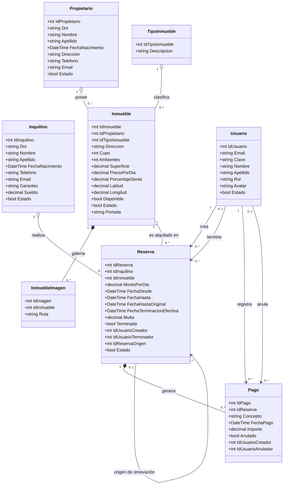

# 🏢 Proyecto Inmobiliaria MVC

### *Creamos un sistema de gestión de alquileres temporarios de propiedades inmuebles que realiza una agencia inmobiliaria.*    

## 📅 Entrega
- Materia: Laboratorio de Software II
- Proyecto: Sistema de Gestión Inmobiliaria (ASP.NET Core MVC + MySQL)
- Entrega: Entrega 1 - ABM Propietarios e Inquilinos

## 👥 Integrantes
- *Hoyo, Jeremias - jeremiashoyo035@gmail.com - @Ego572 https://github.com/Ego572 - Discord: agony9999*  
- *Mazza, Agustin - agusmazza@gmail.com - @AgustinMazza https://github.com/AgustinMazza - Discord: cote8942*  
- *Rodríguez, Juan Cruz - juancruzrodriguez0@gmail.com - @JuanCRodriguez0 https://github.com/JuanCRodriguez0 - Discord: juancruzr*  


## 📊 Modelado de Datos

*A continuación se presenta el esquema del modelo de datos correspondiente a la aplicación.*

### *Diagrama de Clases*  



## 💾 Pasos a seguir para levantar la BD

### 1. Requisitos Previos
* .NET SDK 8.0 o superior
* MySQL Server
* IDE recomendado: Visual Studio Code
* Interfaz recomendada para la Base de Datos: DBeaver

### 2. Base de Datos
## 🗄️ Configuración de la Base de Datos (DBeaver)

1. **Crear la Base de Datos:**
   * Abrir DBeaver y conectarse al servidor MySQL local.
   * Hacer clic derecho sobre la conexión en el panel izquierdo $\rightarrow$ **Create** $\rightarrow$ **Database**.
   * Nombrar la base de datos como `inmobiliaria_db` y presionar **OK**.

2. **Ejecutar el Script SQL:**
   * Abrir el archivo `init.sql` ubicado en la carpeta `/Scripts` del proyecto.
   * Copiar todo su contenido.
   * En DBeaver, con la base de datos `inmobiliaria_db` seleccionada, presionar `Ctrl + ALT + X` (o ir al menú **SQL Editor** $\rightarrow$ **New SQL Script**).
   * Pegar el contenido del script.
   * Ejecutar todo el script presionando el botón **Execute Script** (el ícono con la hoja y el rayo naranja) o `Alt + X`.

3. **Verificar Tablas:**
   * Hacer clic derecho sobre la base de datos `inmobiliaria_db` en DBeaver y seleccionar **Refresh** (`F5`).
   * Desplegar la sección **Tables** para confirmar la presencia de `propietarios`, `inquilinos`, `tipos_inmueble`, `inmuebles`, `inmueble_imagenes` y `reservas`.


## ▶️ Cómo correr el proyecto

```bash
cd ProyectoInmobiliaria-Hoyo-Mazza-Rodriguez
dotnet restore
dotnet run
```

## 👤 Usuario inicial

Al arrancar por primera vez (si la tabla `usuarios` está vacía), el sistema crea automáticamente un usuario Administrador:

- **Email:** `admin@inmobiliaria.com`
- **Contraseña:** `Admin123!`

Con ese usuario podés ingresar y desde el menú "Usuarios" (visible solo para Administradores) crear al resto de los usuarios del equipo.

## 🗺️ Mapa para cargar ubicación

Para elegir la latitud/longitud de un inmueble se usa un mapa interactivo (Leaflet + OpenStreetMap): no requiere API key ni configuración adicional, funciona apenas se levanta el proyecto.

## 📁 Estructura del proyecto
Controllers/ Lógica de cada entidad (Inmueble, Reserva, Pago, etc.)
Models/ Clases de dominio y ViewModels
Models/Repositorio/ Acceso a datos (ADO.NET + MySqlConnector)
Helpers/ Utilidades (hash de contraseñas)
Views/ Vistas Razor (.cshtml)
wwwroot/ Archivos estáticos, JS propio (buscadores, mapa) e imágenes subidas
Scripts/ Script SQL de creación de la base y migraciones


## ⚠️ Notas
- Las imágenes de los inmuebles (portada y galería) se guardan en `wwwroot/images/inmuebles/`. Esa carpeta se crea sola la primera vez que se sube una imagen.
- Los borrados de Propietario, Inquilino, Inmueble, Reserva y Usuario son bajas lógicas (el registro no se pierde, solo se marca como inactivo); solo los Administradores pueden ejecutarlas.
